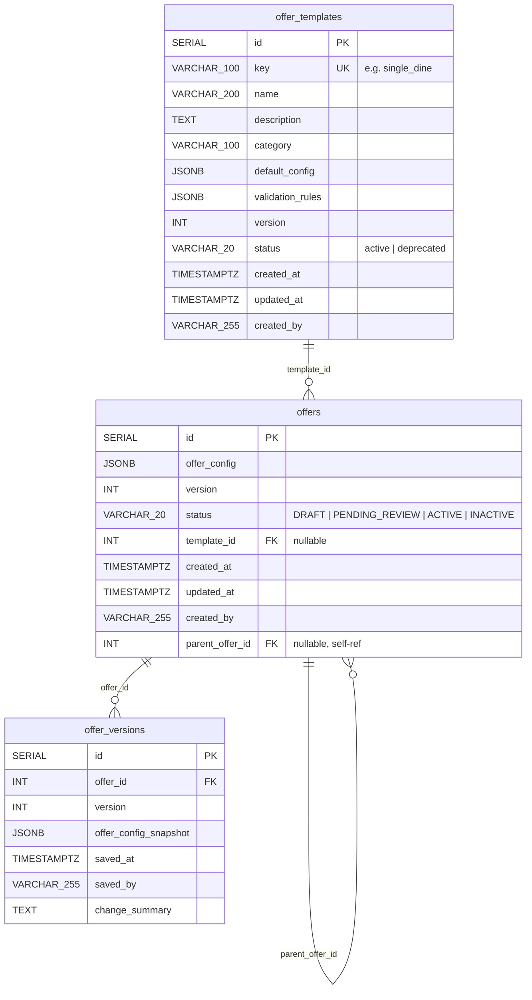

# Nova Offer Configuration — Entity Relationship Diagram

## ERD

## Relationships

| From | To | Cardinality | FK Column | On Delete | Description |
|---|---|---|---|---|---|
| `offer_templates` | `offers` | One-to-many | `offers.template_id` | `SET NULL` | Template used to create the offer. Nullable for offers built from scratch. |
| `offers` | `offer_versions` | One-to-many | `offer_versions.offer_id` | `CASCADE` | Audit trail — one version row per save. Deleting an offer deletes its history. |
| `offers` | `offers` | Self-referencing | `offers.parent_offer_id` | `SET NULL` | Tracks clone lineage. Nullable — only set when an offer was cloned from another. |

## Notes

- `offer_config` JSONB retains `template_type` string for display/backward compatibility. The `template_id` FK is the authoritative relationship.
- `offer_templates.status` uses lowercase (`active`/`deprecated`), while `offers.status` uses uppercase (`DRAFT`/`ACTIVE`/etc.) to distinguish the two lifecycles.
- Unique constraint on `(offer_versions.offer_id, offer_versions.version)` prevents duplicate version entries.
